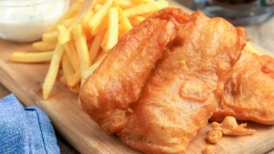
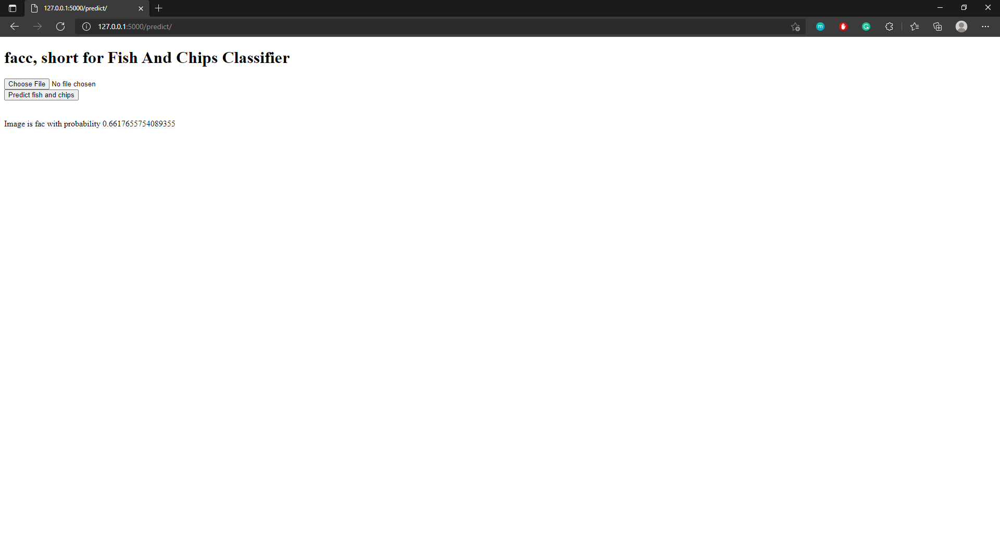

# facc - fish and chips classifier

fish and chips classifier, or facc for short, provides a user experience to classify images into two categories: 'fish and chips' and 'not fish and chips'

## Development on Windows

```cmd
# Create a Python virtual environment
python -m venv env
# Activate virtual environment
env\Scripts\activate
# Install dependencies
pip install -r requirements.txt
```

# Image data

Fish and chips             |  Not fish and chips
:-------------------------:|:-------------------------:
  |  

<table>
  <tr>
    <td>
      
    </td>
    <td>
      
    </td>
  </tr>
</table>
## Unzip data
Manually unzip data.zip for the training data

Data folder structure should look like this:
```
facc
├── data.zip
├── data
│  ├── fishandchipsimgs
│  │  ├── 0.jpg
│  │  ├── 1.jpg
│  │  ├── 2.jpg
│  │  └── ...
│  └── notfishandchipsimgs
│     ├── 0.jpg
│     ├── 1.jpg
│     ├── 2.jpg
│     └── ...
├── screenshots
├── .gitignore
├── app.py
├── helper_functions.py
└── README.md
```

## Alternatively, use [image-scraper](https://github.com/theojl6/image-scraper) to create your own dataset in the format above
In this case, use image-scraper twice to get folders for 'fishandchipsimgs' and 'notfishandchipsimgs', and put them into a folder named 'data'.


## Run python scripts to train and export a deep learning model into a 'models' folder

```cmd
# A fine-tuned deep learning model
python train_model.py
```

## Run local development server for Flask app

```cmd
# Uses the deep learning model
python app.py
```

Go to http://127.0.0.1:5000/ on browser

Upload photo and predict.



## How it works - deep learning

facc deep learning is trained using less than a total of 200 images, which consists of fish and chips, and food that is not fish and chips.

Transfer learning - a pre-trained ResNet50 model with ImageNet was used, and its input layer and last layers have been replaced, the model was then fine-tuned using our small dataset of less than 200 images, in order to serve our purpose of predicting images that are fish and chips versus not fish and chips.

~ 85% validation accuracy is achieved
