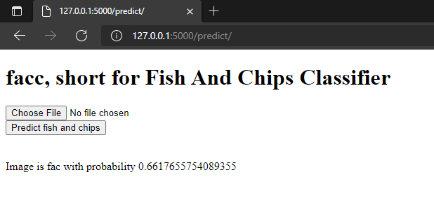

# facc - fish and chips classifier

fish and chips classifier, or facc for short, provides a user experience to classify images into two categories: 'fish and chips' and 'not fish and chips'

# Development on Windows

```shell
# Create a Python virtual environment
$ python -m venv env
# Activate virtual environment
$ env\Scripts\activate
# Install dependencies
$ pip install -r requirements.txt
```

# Unzip data
Manually unzip data.zip for the training data

# Run python scripts to train and export models into a 'models' folder

```shell
# A fine-tuned deep learning model
$ python export_deep_model.py
# Linear machine learning classifier (WARNING: work in progress)
$ python export_ml_classifier.py
```

# Run local development server for Flask app

```shell
# Uses the deep learning model
$ python app.py
```

Go to http://127.0.0.1:5000/ on browser

Upload photo and predict.


